## 茗名之中——为什么茶的拉丁学名Camellia sinensis与tea无关

虽然今人大多称其为“茶”，但由于茶饮料制法多样、茶文化影响深远，茶这种植物，在中国古代并无统一的称呼。陆羽在《茶经》中就说[^1]，“其名一曰茶，二曰槚，三曰蔎，四曰茗，五曰荈”。在茶文化发源地，茶的命名尚且如此容易混淆，在西方世界，人们对于这种神秘的东方饮料，就更容易产生种种误会。今天，这种世界饮料被英国人称为tea、被法国人称为thé、被德国人称为tee、被西班牙人称为té、被意大利人称为tè……[^2]但从茶的拉丁学名Camellia sinensis中却丝毫看不到tea的影子。这一奇特现象的出现，正是源于西方近代以来关于茶的误会以及历史的机缘巧合。

常用名与学名不同是非常常见的现象，例如土豆的学名[^3]是阳芋Solanum tuberosum。此外，原产于东方的植物拉丁学名，从属于命名自原产于西方的植物的更高级别分类，也不在少数，例如月季花Rosa chinensis就从属于命名自玫瑰的蔷薇属。但茶的情况与此二者不同。比较整合分类学资讯系统[^4]（Integrated Taxonomic Information System, ITIS）与物种2000中国节点[^5]，茶及其近亲的拉丁学名与中文学名可以大致对照如下：

* 山茶科Theaceae（常用名tea）
  * 山茶属Camellia（常用名tea）
    * 茶C. sinensis[^6]（常用名tea）
    * 山茶C. japonica（常用名camellia）
    * 滇山茶C. reticulata
    * ……
  * 旃檀属Stewartia
  * ……

显然，常用名tea是科名Theaceae的词根，因此C. sinensis中不包含tea并非出于通用名词与专有名词之间的矛盾。另一方面，在中文学名甚至不是“茶科”而是“山茶科”的情况下，词根tea能够进入主要物种均来自东方的科名Theaceae中、却反而没有进入属名Camellia中，就更显奇怪。此外，属名Camellia来自山茶C. japonica的常用名，自然有其缘故。由此可见，一定是特殊原因导致被广泛使用的tea没能成为属名。

谈到植物命名，无法回避Carl Linnaeus（受封贵族后为Carl von Linné）的《植物种志（Species Plantarum）》，茶也不例外。

	(a)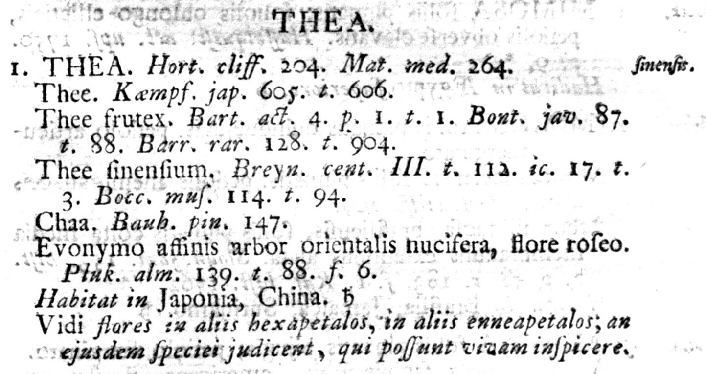
	(b)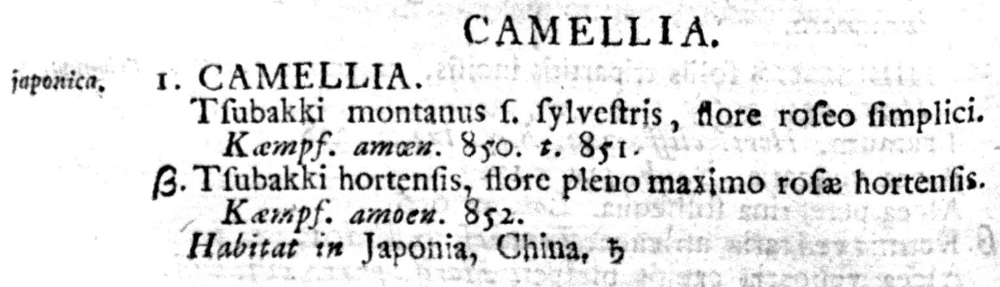

> **图1** (a). Thea sinensis, 见于初版《植物种志》第一卷515页[^7]. (b). Camellia japonica, 见于初版《植物种志》第二卷698页[^8].

	(a)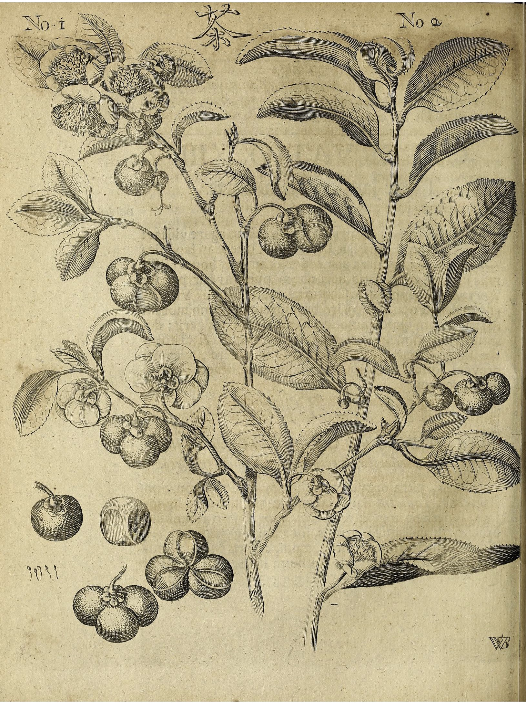
	(b)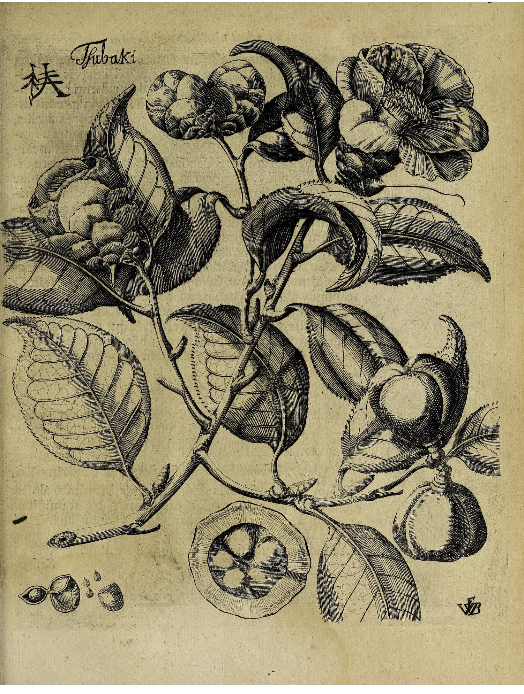

> **图2** (a). thea见于《异域采风记》605-6页[^9]. (b). tsubaki见于《异域采风记》850-1页.

关于茶，在1753年初版的《植物种志》第一卷和第二卷中，分别记载了两种植物Thea sinensis与Camellia japonica（图1），并且注释中说明两者都参考了Engelbert Kaempfer的著作《异域采风记（Amoenitatum Exoticarum）》（图2）。Kaempfer是德国探险家、博物学家[^10]，于1690至1692年旅居日本，《异域采风记》是其两部游记之一，出版于1712年，其中记载了大量有关日本及周边国家的植物。Linnaeus对其人及著作评价甚高，例如银杏属名Ginkgo就是直接采用了Kaempfer的记载[^11]。很明显，属名Thea是直接采用了Kaempfer的表述，但属名Camellia却没有直接采用Kaempfer的tsubaki。

属名Camellia，普遍认为是为了耶稣会传教士、博物学家Georg Joseph Kamel而取[^12]。Kamel[^13]以传教士身份于1687年抵达菲律宾，在旅菲期间，对于当地动植物都有大量记载，虽然他并未留下任何关于茶或山茶的记录。不过，Kamel的著作在欧洲并没有产生巨大影响，Linnaeus对其学术评价也不高[^14]，称他“Descriptiones imperfectae. Florum nulla notita.（记载不完善，没有对花的描述）”。

由此可见，在初版《植物种志》中，Linnaeus依据《异域采风记》分辨了Thea sinensis（茶）与Camellia japonica（山茶）两种植物，但错误地认为两种植物属于不同的属。这使得Camellia一词有了“可乘之机”——假如Linnaeus正确地认识到两种植物同属一属，考虑到他对于Kaempfer的推崇和对于Kamel的批评，很有可能这唯一的“茶属”会被命名为Thea。正因Linnaeus的这一错误，他不得不“勉为其难”地用Kamel命名一个本不应存在的属。

当然，并不能因此苛责Linnaeus，因为在18世纪，西方对于茶的认识非常匮乏，不仅不知道茶和山茶是什么关系，甚至连红茶和绿茶的关系都不清楚。在1762年《植物种志》再版第一卷（图3）中，Linnaeus甚至改对为错，将Thea属下的T. sinensis除去，代之以T. bohea与T. viridis两个物种。从注释上看，他是参考了John Hill的著作《异国植物图鉴（Exotic Botany Illustratic）》（图4），将T. sinensis改称T. bohea，并另加新条目T. viridis[^15]。

	(a)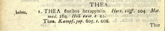
  (b)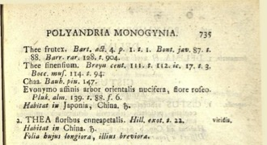

> **图3** T. bohea与T. viridis见于再版《植物种志》第一卷734-5页[^16].

	(a)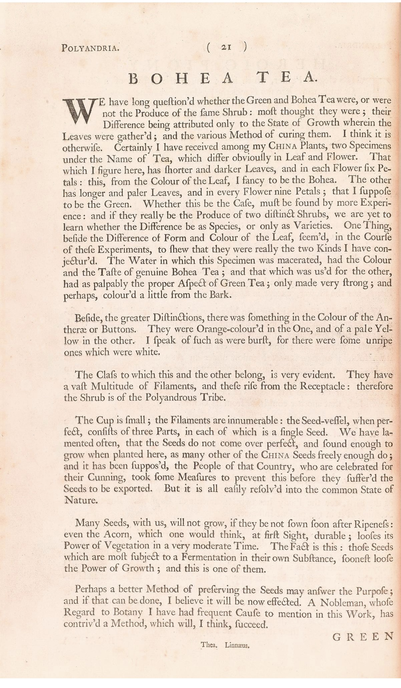
	(b)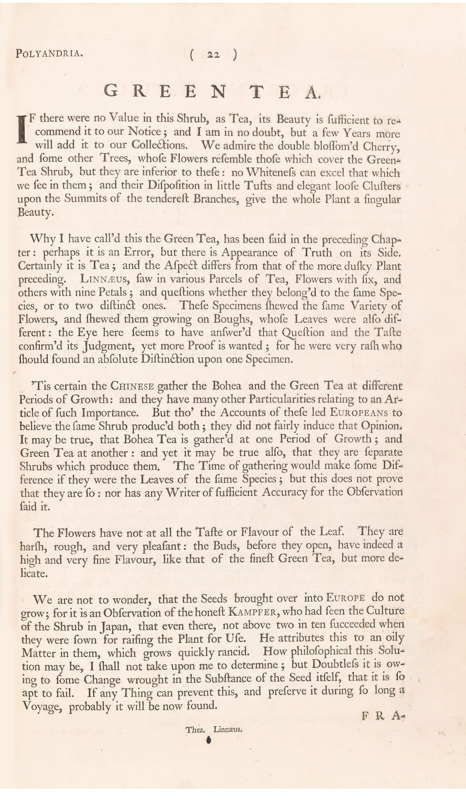

> **图4** (a). Bohea tea见于《异国植物图鉴》第21项[^17]. (b). Green tea见于《异国植物图鉴》第22项.

这种对于红茶与绿茶的错误区分事实上在欧洲大众的思想里根深蒂固[^18]，毕竟两种饮料看起来那样不同。虽然Kaempfer等旅中或旅日探险家的确清楚不同茶饮料来自同种植物，但欧洲学者Francois Valentyn、Jonas Hanway、John Hill等人却以讹传讹，毫无根据地声称红茶与绿茶来自不同植物，而这些学者及其著作又对Linnaeus产生了很大影响，例如Hill与Linnaeus虽未曾见面却常有书信往来，且在英国大力推广其著作。在一系列学者的误传之下，Linnaeus动摇了，并最终在第二版《植物种志》中改对为错。这一误会几乎持续了一整个世纪，一切尘埃落定要等到1843年，Robert Fortune被派往中国“偷师”[^19]，才最终使关于茶的正确认识得到普及。

在1772年至1843年之间，植物学家们通过更加仔细地比较植物标本，逐渐意识到[^20]，不仅红茶T. bohea与绿茶T. viridis实为同一种植物，它们和山茶Camellia japonica也是近亲。1772年John Coakley Lettsom首先明确指出红茶与绿茶产自同种植物，“据观察，把绿茶树种在红茶茶乡，就会产出红茶，反之亦然”（图5）。随后，1807年John Sims在把红茶与绿茶视为同种植物Thea chinensis的基础上，提及Thea与Camellia也应归入同一个属，但却“不愿意更改属名”，希望“等所有相关的植物都被仔细研究之后”再作定夺（图6）。1818年，Robert Sweet在编目伦敦植物时，首先将C. bohea、C. viridis、C. japonica全部归入Camellia属，不过没有更多说明（图57）。1824年，Augustin Pyrame de Candolle在正确将T. bohea与T. viridis归为同一种T. chinensis的基础上，将Thea属与C. japonica所在的Camellia属归为同一目Camellia（图8）。

	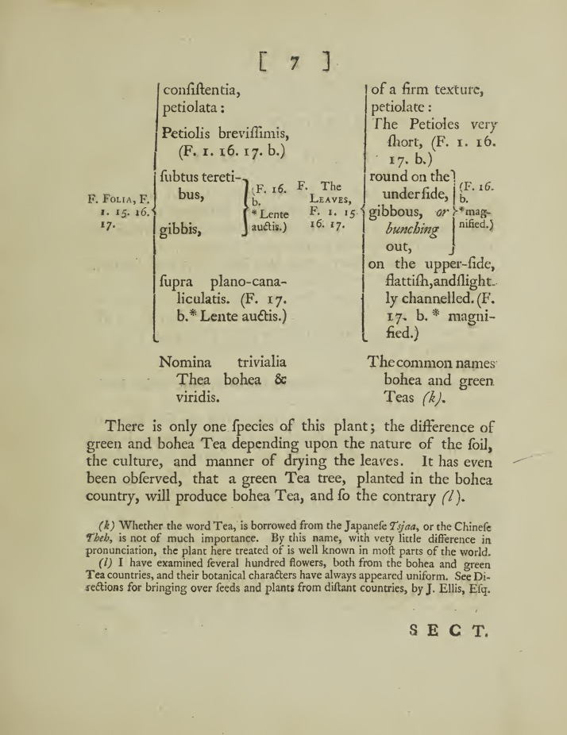

> **图5** (a). 1772年Lettsom指出只有一种茶植物[^21].

	(a)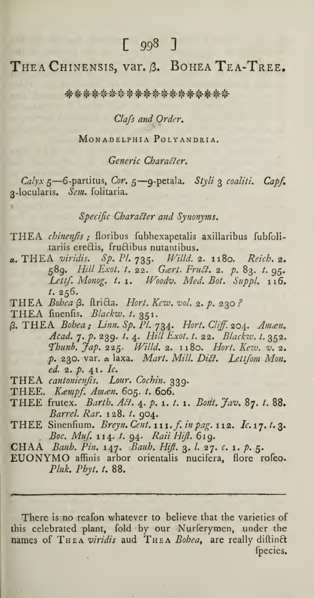
	(b)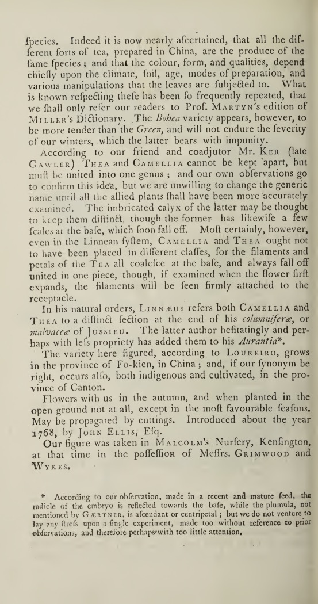

> **图6** 1807年Sims提出只有一个属[^22].

	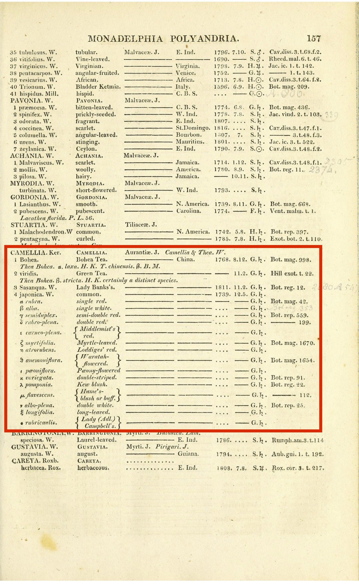

> **图7** 1818年Sweet将三种植物归入Camellia属[^23], 红框为笔者所加.

	(a)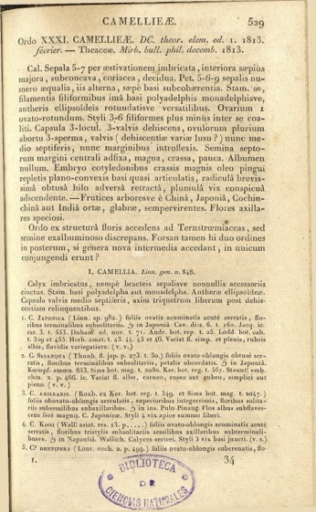
	(b)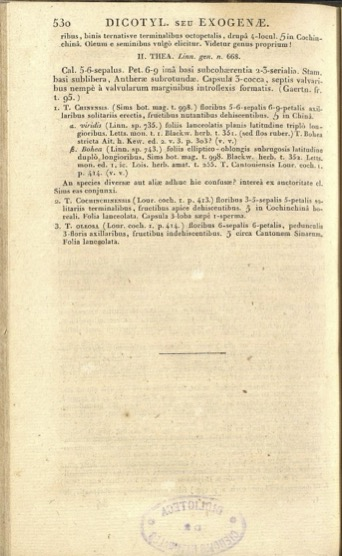

> **图8** 1824年de Candolle将Thea属与Camellia属归入Camellia目[^24].

随着1906年学术界达成共识[^25]并订立《国际植物命名法规（International Code of Botanical Nomenclature）》[^26]，植物命名有了标准的原则。根据2018年最新版本的《法规》13.4条注释1，Linnaeus的两卷《植物种志》，虽然出版时间相差三个月，但应视作同时出版。这样一来，茶同时拥有了两个属名：Thea（第一卷）与Camellia（第二卷）。在出现这种分歧时，根据11.5条，应采取此后最早的有效出版物的选择。对于茶，在《植物种志》初版后，首先明确将其与山茶同属一属的是Sweet。虽然他仍然错误地区分了C. bohea与C. viridis，但却明确选择了Camellia作为属名而Thea作为别名。因此，茶的属名被确定为Camellia，结合初版《植物种志》中T. sinensis的条目，茶的学名最终成了C. sinensis，虽然植物学家也为tea这个词根打抱不平而最终将Camellia属所在科命名为Theaceae。细究起来，历史上，最早明确两卷《植物种志》视作同时出版的是1950年版《法规》（在该版中为第20条）。如果没有这一条款，将《植物种志》第一卷视为首先出版，那么茶与山茶的属名就应同为Thea。

由此可见，茶的学名被最终确定为Camellia sinensis之前，有一段颇为曲折的历史，充满各种巧合——第一，恰巧Linnaeus误认为茶与山茶不同属，否则有极大可能Camellia这个属名根本不会存在；第二，恰巧Sweet将红茶、绿茶、山茶收入同一个属时采用了Camellia作为属名；第三，恰巧在Sweet之前的学者没有坚定到将茶与山茶明确为同属；第四，恰巧首先正确分类红茶、绿茶、山茶的de Candolle发表文献晚于Sweet；第五，恰巧《法规》将两卷《植物种志》视为同时出版，否则追溯至第一卷中仍应采取Thea作为属名。

不过，巧合之中也有必然性，诞生于西方的现代科学与现代植物学命名体系，将历史上由于文化交流不畅造成的误会留存至今。每每想及此处，笔者总不免为tea没能出现在“属+种差”这个直接的拉丁学名之中而深感遗憾。

------

[^1]: https://ctext.org/wiki.pl?if=gb&chapter=563466, 《茶经·一之源》, 中国哲学书电子化计划.

[^2]: 与大部分西欧语言不同, 在葡萄牙语中茶甚至就是chá, 这是由于早年葡萄牙与中国的贸易主要在广东进行, 而欧洲大部分地区tea的读音都源自在福建进行贸易的荷兰. 参见George van Driem, *The Tale of Tea: A Comprehensive History of Tea from Prehistoric Times to the Present Day*, Brill, 2019.

[^3]: 本文出现的所有植物当代学名均来自ITIS（拉丁文）与物种2000中国节点（中文）数据库, 见后.

[^4]: http://www.itis.gov/, Integrated Taxonomic Information System.

[^5]: http://www.sp2000.org.cn/, 物种2000中国节点.

[^6]: 种加词sinensis意为“来自中国”, 下文japonica意为“来自日本”.

[^7]: https://www.biodiversitylibrary.org/item/13829, *Species Plantarum*, vol. 1, Biodiversity Heritage Library.

[^8]: https://www.biodiversitylibrary.org/item/13830, *Species Plantarum*, vol. 2, Biodiversity Heritage Library.

[^9]: https://www.biodiversitylibrary.org/item/247417, *Amoenitatum Exoticarum*, Biodiversity Heritage Library.

[^10]: https://en.wikipedia.org/wiki/Engelbert_Kaempfer, Engelbert Kaempfer, Wikipedia.

[^11]: https://www.nature.com/articles/448139a, *Linnaeus and taxonomy in Japan*, His Majesty The Emperor of Japan, Nature 448, 139-140 (2007). 这是一篇平成天皇的演讲.

[^12]: 见*The Tale of Tea*.

[^13]: https://en.wikipedia.org/wiki/Georg_Joseph_Kamel, Georg Joseph Kamel, Wikipedia.

[^14]: https://www.euppublishing.com/doi/10.3366/E0260954109000989, *Botany and zoology in the late seventeenth-century Philippines: the work of Georg Josef Camel SJ (1661-1706)*, Raquel A. G. Reyes, Archives of Natural History 36 (2), 262-76 (2009).

[^15]: 种加词viridis意为“绿色”, 前文bohea是武夷茶即红茶的音译.

[^16]: https://bibdigital.rjb.csic.es/records/item/10612-redirection, *Species Plantarum*, vol. 1, 2nd ed, Biblioteca Digital.

[^17]: https://www.biodiversitylibrary.org/item/214429, *Exotic Botany Illustrated*, Biodiversity Heritage Library.

[^18]: 历史上欧洲人有关红茶与绿茶的误会见*The Tale of Tea*.

[^19]: 《南京条约》开放五口通商, Fortune在上海入境, 乔装打扮为清人模样, 打探搜集与茶相关的一切信息.

[^20]: 本段相关文献参考自*The Tale of Tea*, 但该书部分细节有误, 例如Sims著作的出版年份被写作1808年. 本段所有引用均来自一手文献.

[^21]: https://archive.org/details/b3041104x, *The natural history of the tea-tree*, p. 7, Internet Archive.

[^22]: https://archive.org/details/s1id13292270, *Curtis’s botanical magazine*, vol. 25, no. 998, Internet Archive.

[^23]: https://www.biodiversitylibrary.org/bibliography/109914, *Hortus surburbanus Londinensis*, p. 157, Biodiversity Heritage Library.

[^24]: https://bibdigital.rjb.csic.es/viewer/14907, *Prodromus Systematis Naturalis Regni Vegetalis*, part one, p. 529-30, Biblioteca Digital.

[^25]: https://www.iapt-taxon.org/historic/index.htm, Overview of editions of the Code, International Association for Plant Taxonomy. 这里收集了《法规》的历代版本. 后文所述各版《法规》条款均出自此处.

[^26]: 在2011年国际植物学大会上, 《国际植物命名法规》被更名为《国际藻类、真菌与植物命名法规（International Code of Nomenclature for algea, fungi, and plants）》并沿用至今.
